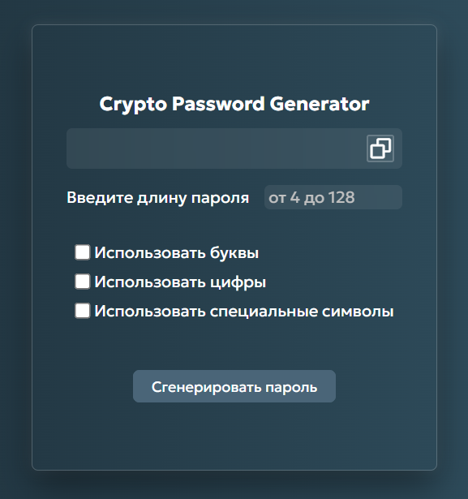

# 🔒 Crypto Password Generator

<div align="center">
  
</div>

### [EN]

### About the Project

**Crypto Password Generator** is a strong password generator. The project uses the **crypto.getRandomValues() method built into JavaScript from the Web Crypto API**, instead of the standard Math.random() method.
Since most online projects use Math.random(), such generators cannot be considered completely secure, as they are, at a minimum, cryptographically weak.

The algorithm in such projects is predictable, making these passwords unsafe to use.

**crypto.getRandomValues()** takes randomness from the operating system's cryptographically strong pseudorandom number generator (CSPRNG). The algorithm behind this method is not disclosed, making such passwords significantly more secure from attackers.

### Features
* Customizable password length from 4 to 128 characters
* Choice of different character sets: letters, numbers, and special characters
* Guaranteed inclusion of at least one character from each selected set
* Shuffling of the resulting password using the Fisher-Yates algorithm to ensure guaranteed characters do not end up in predictable positions.
* Discarding excess random values ​​during generation - each character has an equal chance of being included in the password
* Validation of all fields

### Technology Stack

* HTML5 (BEM)
* CSS3
* JavaScript (Vanilla)
* Web Crypto API (crypto.getRandomValues())

### Installation and Run

The project can be run locally and without build tools.

```
git clone https://github.com/R3nfix/crypto-password-generator.git
cd crypto-password-generator
```

Then run index.html directly from the project folder. The project is running and ready to go!

### Usage

1. Run the project locally or using one of the links below.
2. Specify the desired password length (4 to 128 characters)
3. Select the character sets you want to see in your password (letters, numbers, special characters)
4. Click the password generation button - the password will be generated and will appear in the first field.
5. If necessary, copy your password by clicking the "Copy" button in the first field.

### Project Links

[GitHub Pages](https://r3nfix.github.io/crypto-password-generator/)  
[Netlify](https://crypto-pass-generator.netlify.app/) (may not work in Russia without a VPN)

### [RU]

### О проекте

**Crypto Password Generator** - это генератор надёжных паролей. В проекте используется встроенный в JavaScript метод **crypto.getRandomValues() от Web Crypto API**, вместо стандартного метода Math.random().
Поскольку большинство проектов в интернете используют Math.random() - такие генераторы нельзя назвать полностью безопасными, поскольку как минимум они ненадежны криптографически.  
Алгоритм в таких проектах предсказуем, что делает эти пароли небезопасными для использования.

**crypto.getRandomValues()** берёт случайность из криптографически стойкого генератора псевдослучайных чисел (CSPRNG) операционной системы. Алгоритм такого метода не раскрывается, что делает такие пароли значительно безопаснее от различных злоумышленников.

### Возможности
* Настраиваемая длина пароля от 4 до 128 символов
* Выбор различных наборов символов: использование букв, использование цифр, использование специальных символов
* Гарантированное включение хотя бы одного символа из каждого выбранного набора
* Перемешивание итогового пароля по алгоритму Фишера-Йетса, чтобы гарантированные символы не оказывались на предсказуемых местах.
* Отбрасывание избыточных случайных значений при генерации - каждый символ имеет равные шансы попасть в пароль
* Валидация всех заполняемых полей

### Стек технологий

* HTML5 (BEM)
* CSS3
* JavaScript (Vanilla)
* Web Crypto API (crypto.getRandomValues())

### Установка и запуск

Проект можно запускать локально и без сборщиков

```
git clone https://github.com/R3nfix/crypto-password-generator.git
cd crypto-password-generator
```

Затем запустите index.html прямо из папки проекта. Проект запущен и готов к работе!

### Использование

1. Запустите проект локально или по одной из ссылок ниже.
2. Укажите желаемую длину пароля (от 4 до 128 символов)
3. Выберите наборы символов, которые вы хотите видеть в своем пароле (использование букв, использование цифр, использование специальных символов)
4. Нажмите кнопку генерации пароля - пароль будет сгенерирован и появится в первом поле.
5. При необходимости скопируйте ваш пароль, нажав на кнопку "Скопировать" в первом поле.

### Ссылки на проект

[GitHub Pages](https://r3nfix.github.io/crypto-password-generator/)  
[Netlify](https://crypto-pass-generator.netlify.app/) (может не работать в РФ без VPN)
